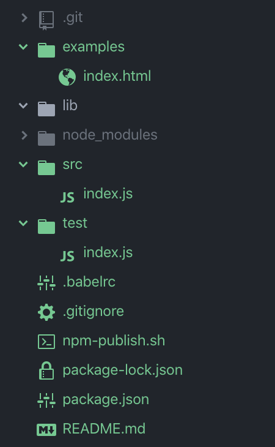

## npm-plugins-building-shell

>这是一个快速搭建基于npm的js库的shell文件，他会在`~/Public/mynpm`目录下创建你的npm项目，如果您没有这个目录，它会自己构建。

## 使用used

```
# 拉项目
git clone https://github.com/nongshuqiner/npm-plugins-building-shell.git
# 进入
cd npm-plugins-building-shell
# 执行
sh npm-plugins-building-shell.sh
```


## 部署steps

>按照指令提示一步步往下走，下面是一个简单的步骤：

第一步：输入你的npm插件名

```
? 请输入你的 npm 插件名(en:Project name)(必须为英文)：
my-npm-libs

...
```

第二步：程序会执行`npm init`，所以需要你进行相关的配置

```
package name: (my-npm-libs)
version: (1.0.0)
description: 发布一个npm包，构建自己的第三方库
entry point: (index.js)
test command:
git repository:
keywords:
author: nongshuqiner
license: (ISC)

...
```

第三步：问询是否需要bable，如果需要请输入y，否则n

```
npm 初始化完成
is need babel？(Y/n):
y

...
```

第四步：是否需要git，如果需要请输入y，否则n

```
babel 安装成功
is need git？(Y/n):
y

...
```

第五步：是否需要单元测试，如果需要请输入y，否则n。这里的单元测试是mocha+chai

```
is need mocha+chai test library？(Y/n):
y

...
```

构建后的项目目录如下：



完成

## 与 npm 发布有关

创建的项目中，会自带一个 `npm-publish.sh`，您可以使用它：

```
sh npm-publish.sh
```
